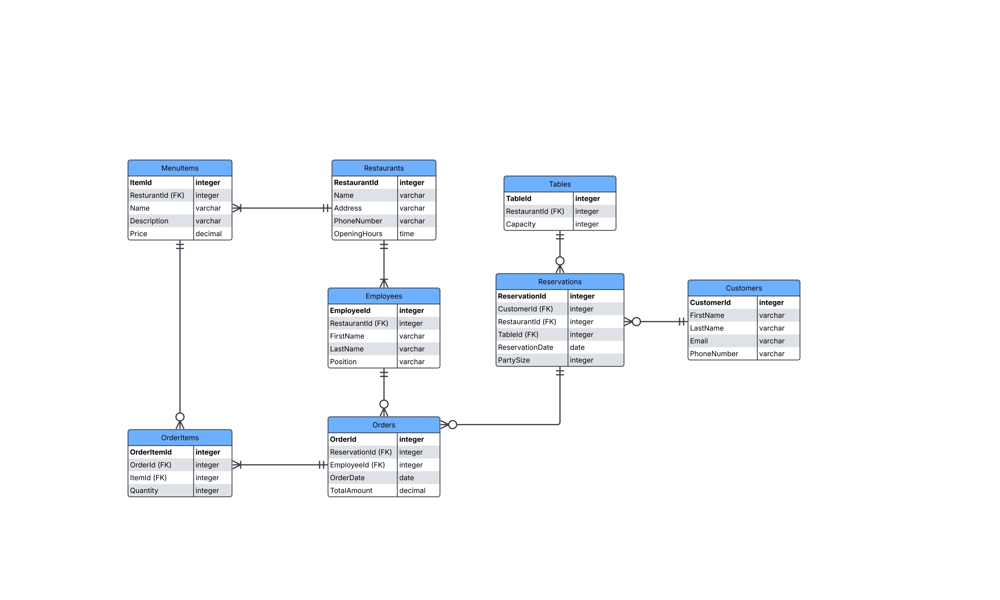

# Restaurant Management Database

## Introduction
This project provides a relational database design and implementation in Microsoft SQL Server for managing restaurant operations. It replaces traditional ordering and reservation systems with a digital platform that streamlines processes such as:

- Tracking customer orders

- Managing menu items

- Handling table reservations

- Generating insights through SQL queries

## ERD Model

